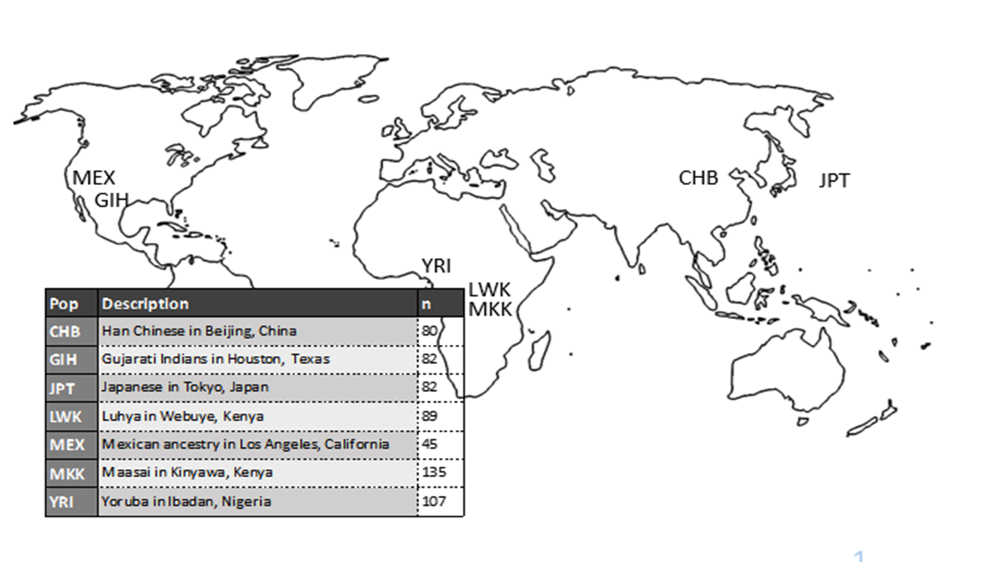
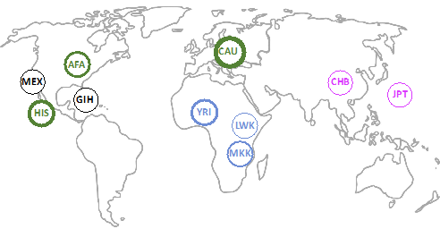

# Population Expression Prediction
## HapMap3 cohort
  Stranger_et_al_pop_eQTLs
  next steps:
  build predictors combining continental groups and all pops (Jenny and Elyse)
  Jenny and Elyse will rerun MatrixEQTL and PredictDB elastic net pipeline on all HapMap pops and continent combos with the   newly mapped ENSG IDs - Dr. Wheeler needs to move Jenny's results to ROCKS cluster at Stritch

## Models:
#### International HapMap Project Models
1. ALL model: all seven populations 
2. ASN model: two East Asian populations--Han Chinese and Japanese
3. AFR model: three African populations-- Luhya, Maasai, and Yoruba 

#### Multi-Ethic Study of Atherosclerosis (MESA)
1. ALL model: European, African American, and Hispanic populations combined
2. AFA model: African American population, n = 233
3. AFHI model: African American population and Hispanic population combined
4. HIS model: Hispanic population, n = 352
5. CAU model: European population, n = 578

## GWAS Catalog Summary Stats S-PrediXcan
Use HapMap models and MESA models in S-PrediXcan of relevant GWAS Catalog Summary Statistics (Elyse and Isabelle)
Fast-Enloc pipeline for colocalization (Elyse and Isabelle).

### Step 1: Clone the S-PrediXcan repository to your workspace/
To clone the repository into your workspace, run the following in 

`git clone https://github.com/hakyimlab/MetaXcan.git`

S-PrediXcan is an extension of PrediXcan that takes GWAS Summary Statistics and gene expression prediction models to make PrediXcan-level associations. 

### Step 2: Download GWAS Summary Statistics
Link to the GWAS Catalog: https://www.ebi.ac.uk/gwas/

Find a study from the GWAS Summary Statistics Spreadsheet to run with S-PrediXcan. Those including non-European individuals are highlighted in yellow. Those that are colored red have already been tested. 

Find the particular study by searching the PMID in the GWAS Catalog. Find the study page, and copy the link address of the Summary Statistics found at the bottom right of the page. From the terminal, run: 

`wget link_from_catalog`

If that does not work, download the data as a Guest User directly to the lab computers. From there, run this in the terminal:

`scp -r filepathToDataFromDownloads username@server:/filepath/to/save/to`
